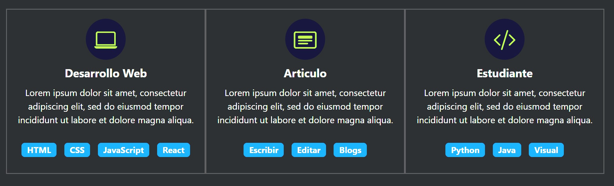
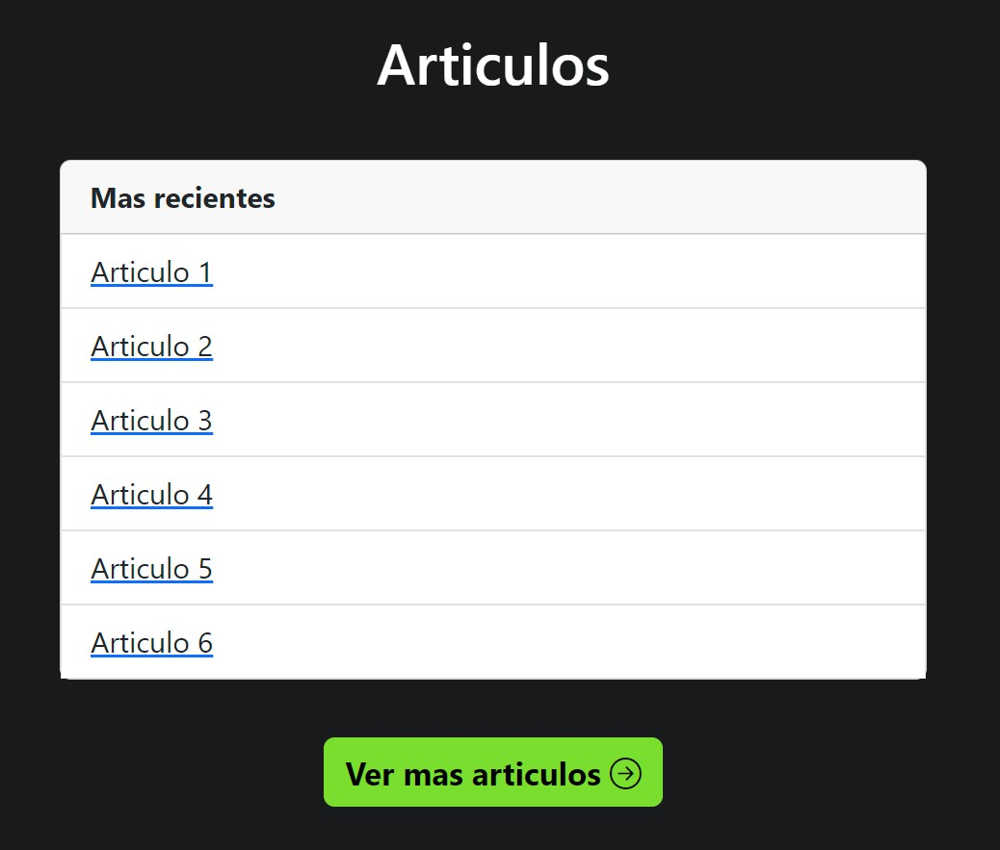
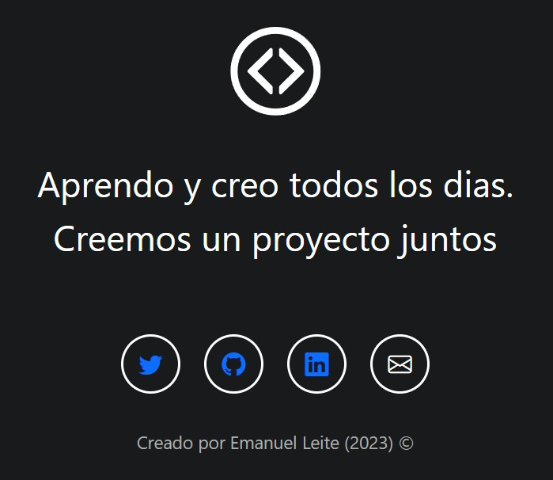

# Proyecto Bootstrap
Este proyecto es un template para un portafolio en línea que se basa en los conceptos fundamentales de Bootstrap.

Principalmente, creé este pequeño template para practicar los fundamentos de Bootstrap, como el Grid, los componentes y los iconos.


## Grid
El Grid es un conjunto de contenedores, filas y columnas que Bootstrap nos ofrece para organizar de elementos de manera rapida, en este proyecto fue aplicado en diferentes secciones.

Para crearlo, se agrega la clase:

```html
<div class="row">
```

Sucesivamente, debemos agregar los elementos de la columna, como Bootstrap maneja grids de 12 celdas, debemos especificar estos datos en la clase:

```html
<div class="columna col-12 col-md-4">
```

Ya dentro de la indentacion, se agrega la informacion necesaria.



## Componentes
En la documentación de Bootstrap, hay una amplia variedad de componentes disponibles para usar. En este caso, decidí utilizar el carrusel y los buttons. Es tan simple como ir a la página oficial de Bootstrap, copiar y pegar el código que deseamos utilizar. Aquí tienes un ejemplo de un carrusel y los button aplicados a mi proyecto: 

En el caso del Carrousel hay declarar la siguiente clase:
```html
<div id="carouselExample" class="carousel slide">
  <div class="carousel-inner">
    <div class="carousel-item active">
      
    </div>
    <div class="carousel-item">
      
    </div>
    <div class="carousel-item">
      
    </div>
  </div>
  <button class="carousel-control-prev" type="button" data-bs-target="#carouselExample" data-bs-slide="prev">
    <span class="carousel-control-prev-icon" aria-hidden="true"></span>
    <span class="visually-hidden">Previous</span>
  </button>
  <button class="carousel-control-next" type="button" data-bs-target="#carouselExample" data-bs-slide="next">
    <span class="carousel-control-next-icon" aria-hidden="true"></span>
    <span class="visually-hidden">Next</span>
  </button>
</div>
```

Y para los buttones, funcionaria agregando este codigo:

```html
<button type="button" class="btn btn-primary">Primary</button>
```

<p align="center">
  
  
</p>

## Iconos
La galería de imágenes de Bootstrap funciona mediante el uso de clases predefinidas que se aplican a los elementos de imagen. Estas clases están diseñadas para proporcionar estilos y características específicas a las imágenes, lo que facilita su implementación en un proyecto.

En la documentación de Bootstrap, se proporciona el código HTML y CSS necesario para utilizar las imágenes de la galería. Simplemente se debe copiar y pegar el código en el lugar deseado del proyecto.


<div align="center">
  
</div>

## Documentacion

[Bootstrap Official Website](https://getbootstrap.com/)
